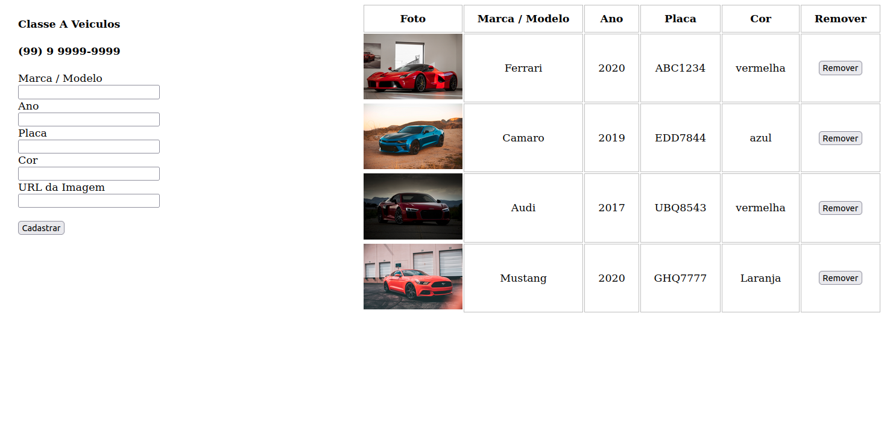

## Classe A Veiculos
 

#### A simple project to manage a company's cars

### how to run

#### with python, use python3 -m http.server here
#### and node app.js on 'server'
#### finally, acess http://localhost:8000/ on browser